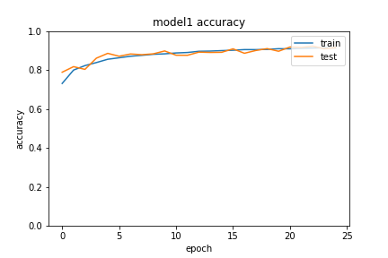
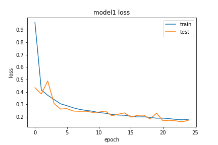
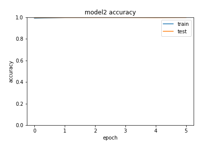
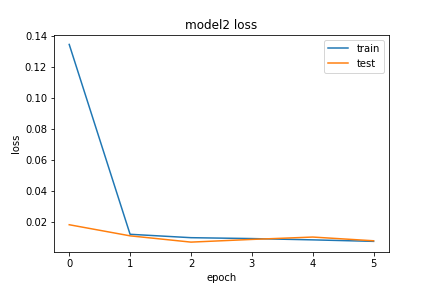
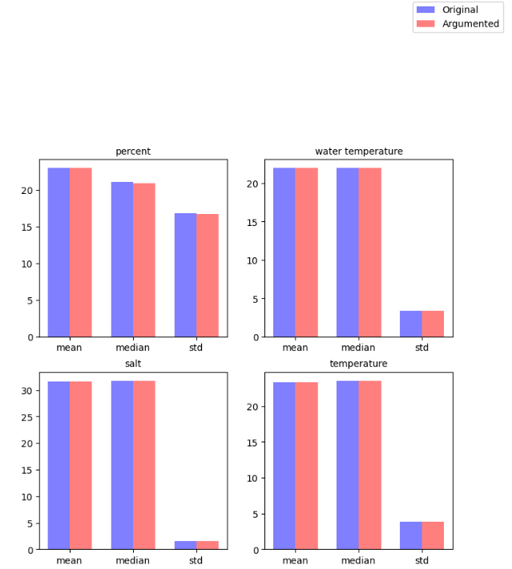
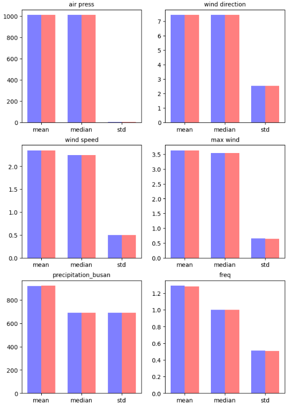
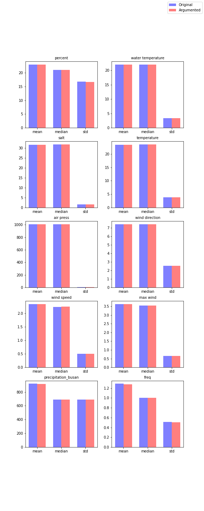

# 2022 K-WATER BIGDATA CONTEST
## Members 
**공민석([kongminseok](https://github.com/kongminseok)), 김성현([sunghyun1356](https://github.com/sunghyun1356)), 엄다린([edr20908](https://github.com/edr20908)), 이정애([Jeong-ae](https://github.com/Jeong-ae)), 임영선([SGT-LIM](https://github.com/SGT-LIM))**

## Model 1 Accuraccy & Loss

## Model 2 Accuraccy & Loss

## Original vs Argumented Statistics

